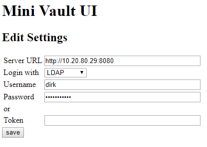

# mini-vault-ui
Minimalistic Vault UI for non technical users

# What it does
This tool gives users a very simple and quick UI access to secrets in Vault. It might help you if you have a help desk or other staff not happy with any CLI tool. 

# What it is
Technically it is a small webserver that uses the Vault API on the backend and presents some html forms on the users side. The ui is written in GO. It can be compiled to a static binary and runs everywhere GO runs. I will provide a precompiled Windows version. 

# How to use it
If you run it on Windows your standard Browser will open the URL to the UI. On other systems you will need to open http://localhost:7777 manually.
## Settings
At the first time you will need to configure the connection to the Vault. You will need the URL and authentication username and password for LDAP to logon to your Vault server.

Vault will give us a security token, which is stored in a cookie. During it's lifetime this token can be reused for authentication. If you come back to this settings page, the token will be preselected and visible.

## Vault list 
After successful authentication you can start to browse through the secrets or delete them. Type a name or path/name in the entry field and press "new" to create new secret. 

## Vault read
A click on a secret to list it's content. Add or delete individual key/value pairs at the top or copy and paste the full JSON at the bottom.

Thats about it.

# Running the UI
You can simply start the binary without any parameters, or provide a different listening port (-p). On Windows it might be helpful to set the starting point within vault to guide your users to the correct path.

     vault-ui -s /list/secret/mytool/plugins/customers
 
 This parameter can be added in a shortcut link on the desktop.
